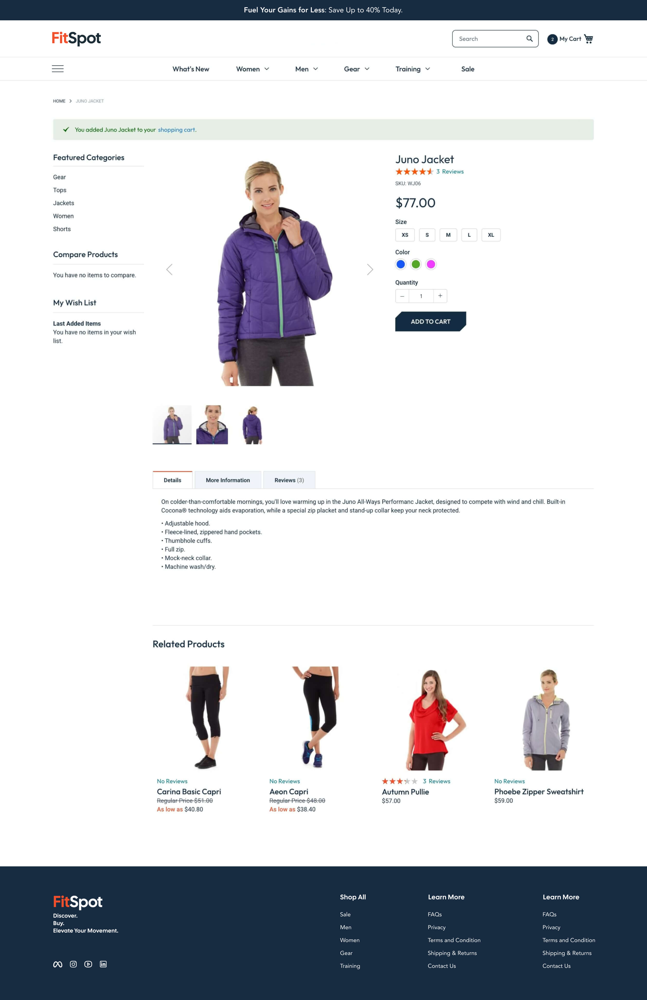
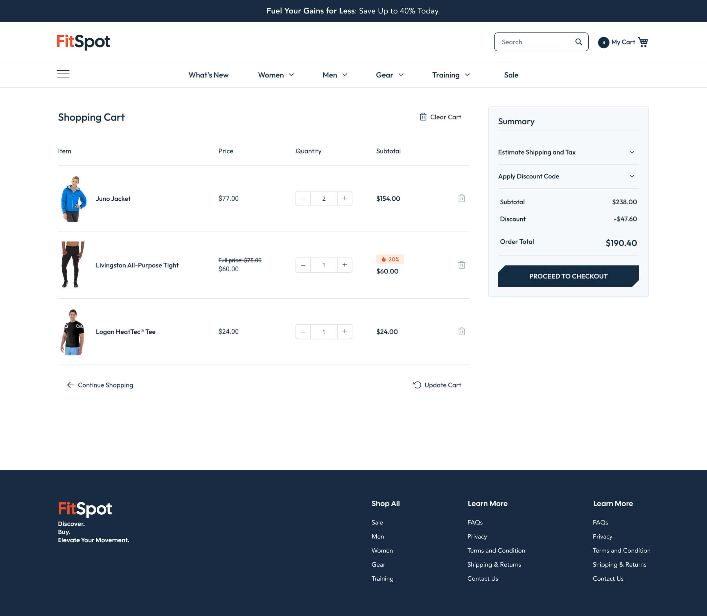

# FitSpot — Discover. Buy. Elevate Your Movement.


> **Purpose:** FitSpot is a fitness e-commerce demo built on **Magento 2 Community Edition**. It showcases a custom storefront theme (`Custom/Blank`) for gym apparel and gear — hero carousel, shoppable categories, featured products, full PDP and cart — backed by Docker for local development.

## Table of Contents

- [Screenshots](#screenshots)
- [Features](#features)
- [Tech Stack & Frameworks](#tech-stack--frameworks)
- [Dependencies & Versions](#dependencies--versions)
- [Project Structure](#project-structure)
- [Custom Theme](#custom-theme)
- [Custom Modules](#custom-modules)
- [Quickstart](#quickstart)
- [Useful Commands](#useful-commands)
- [Docs Index](#docs-index)
- [License](#license)

## Screenshots

### 1. Home — Hero Carousel, Categories, Featured Products


> Full-width hero (“What doesn’t kill you makes you stronger!”), `Gear / Tops / Jackets / Women / Shorts` slider, `Featured Products` grid with ratings, pricing and swatches, custom footer.

### 2. Product Detail — Juno Jacket



> PDP with gallery + thumbnails, size (`XS–XL`), color swatches, qty stepper, `Add to Cart`, Details / More Information / Reviews tabs, `Related Products` carousel.

### 3. Shopping Cart



> Cart line items with qty steppers, discount badge (`-20%`), order summary (`Subtotal / Discount / Order Total`), `Proceed to Checkout`, `Continue Shopping / Update Cart`.

## Features

- Custom storefront header: promo banner, search + mini-cart, mega nav (`What's New / Women / Men / Gear / Training / Sale`)
- Hero carousel module with admin configuration (`Stores > Configuration > Hero Carousel`)
- Category slider, Featured / Latest / Related / Upsell product carousels (Slick)
- Custom PDP layout: gallery, configurable options, related products
- Custom cart layout: qty steppers, clear-cart, discount summary, checkout CTA
- Custom footer with Shop All / Learn More link blocks
- Sample catalog data (Luma-style apparel: Juno Jacket, Livingston Tight, etc.)
- Docker-based local env with OpenSearch, RabbitMQ, Valkey, Mailcatcher, phpMyAdmin

## Tech Stack & Frameworks

| Layer | Framework / Tool | Notes |
|-------|------------------|-------|
| Commerce | Magento 2 Community Edition 2.4.8 | `magento/product-community-edition`, blank-parent theme |
| Backend | PHP 8.3-FPM, Laminas, Symfony 6.4 components | DI, Layout XML, Blocks, ViewModels |
| Frontend | LESS, RequireJS, jQuery, Knockout (Magento defaults) | + Slick carousel, vanilla `main.js` / `load-more.js` |
| Search | OpenSearch 2.12 (default) | Alt: Elasticsearch 8.13 |
| Queue / Cache | RabbitMQ 4.1, Valkey 8.1 (alt Redis 7.2) | Magento MQ, page / session cache |
| Web / DB | Nginx 1.24, MariaDB 11.4 (alt MySQL 8.4) | `markshust/docker-magento:52.1.0` |
| Build | Grunt 1.6.1, Less 4.2.0 | `Gruntfile.js.sample`, `grunt-config.json.sample` |
| Quality | PHPUnit 10.5, PHPStan 1.9, PHPCS, PHP-CS-Fixer 3.22, MFTF 5.0 | Magento Coding Standard |

## Dependencies & Versions

### Core ( `src/composer.json` )

| Package | Version | Purpose |
|---------|---------|---------|
| `magento/product-community-edition` | `2.4.8` | Commerce core |
| `magento/module-*-sample-data` (x19) + `magento/sample-data-media` | `100.4.*` | Demo catalog / CMS / customers / reviews |
| `magento/composer-root-update-plugin` | `^2.0.4` | Magento composer plugin |
| `magento/composer-dependency-version-audit-plugin` | `~0.1` | Dependency audit |
| `magento/magento-coding-standard` | `*` | PHPCS ruleset |
| `magento/magento2-functional-testing-framework` | `^5.0` | MFTF |
| `phpunit/phpunit` | `^10.5` | Unit tests |
| `phpstan/phpstan` | `^1.9` | Static analysis (`bin/analyse`) |
| `friendsofphp/php-cs-fixer` | `^3.22` | Code style fixer |
| `symfony/finder` | `^6.4` | Dev tooling |
| `carlos-mg89/oauth` | `^0.8.17` | Test OAuth |

Full transitive list in `src/composer.lock`.

### Infrastructure ( `compose.yaml` / `compose.dev.yaml` )

| Service | Image | Ports |
|---------|-------|-------|
| `app` | `markoshust/magento-nginx:1.24-0` | `80:8000`, `443:8443` |
| `phpfpm` | `markoshust/magento-php:8.3-fpm-4` | — |
| `db` | `mariadb:11.4` (alt `mysql:8.4`) | `3306:3306` |
| `redis` | `valkey/valkey:8.1-alpine` (alt `redis:7.2-alpine`) | `6379:6379` |
| `opensearch` | `markoshust/magento-opensearch:2.12-0` (alt `elasticsearch:8.13-0`) | `9200, 9300` |
| `rabbitmq` | `markoshust/magento-rabbitmq:4.1-0` | `5672, 15672` |
| `mailcatcher` | `sj26/mailcatcher:v0.10.0` | `1080:1080` |
| `phpmyadmin` (dev profile) | `linuxserver/phpmyadmin` | `8080:80` |

Env templates in `env/` (`db.env`, `opensearch.env`, `rabbitmq.env`, `magento.env`, etc.).

### Frontend build ( `src/package.json.sample` )

| Package | Version |
|---------|---------|
| `grunt` | `~1.6.1` |
| `less` | `4.2.0` |
| `grunt-contrib-less` | `~3.0.0` |
| `grunt-contrib-watch`, `clean`, `cssmin`, `imagemin`, `jasmine` | `~1.1.0` / `~2.0.1` / `~5.0.0` / `~4.0.0` |
| `underscore` | `1.13.7` |

Run via `bin/grunt`, `bin/node`, `bin/npm` inside containers.

## Project Structure

```text
.
├── README.md                # this file (new)
├── README_INSTALL.md        # manual Magento + sample-data install
├── README_THEMING.md        # how Custom/Blank theme was built
├── README_CAROUSEL.md       # HeroCarousel module deep-dive
├── README_HELPERS.md        # Magento / Docker / SQL cheatsheet
├── compose.yaml             # docker-magento 52.1.0 base services
├── compose.dev.yaml         # dev mounts + phpMyAdmin
├── compose.dev-linux.yaml / compose.dev-ssh.yaml / compose.healthcheck.yaml
├── env/                     # db, opensearch, rabbitmq, redis, magento, phpfpm env
├── bin/                     # 50+ helpers (magento, cli, setup, grunt, mysql…)
├── Makefile                 # shortcuts to bin/* helpers
├── docs/
│   └── screenshots/
│       ├── home.jpg         # homepage
│       ├── product.jpg      # PDP
│       └── cart.jpg         # cart
├── template/dev/            # upstream template reference
├── rootCA.pem               # local SSL CA
└── src/                     # Magento 2.4.8 codebase (tracked)
    ├── composer.json / composer.lock
    ├── app/
    │   ├── code/Custom/     # 12 modules + 1 ViewModel helper (see below)
    │   ├── design/frontend/Custom/Blank/  # theme (Magento_Theme, Catalog, Checkout…)
    │   └── etc/             # env.php / config.php (local, not committed)
    ├── pub/static/ generated/ var/  # build artifacts (git-ignored in practice)
    └── vendor/              # composer deps (committed in this snapshot)
```

> `src/` is large because `vendor/` is committed in this repo snapshot. See `src/composer.json` for the source of truth.

## Custom Theme

`src/app/design/frontend/Custom/Blank` (`parent: Magento/blank`):

- `theme.xml` + `registration.php`, `Magento_Theme/layout/default.xml` (custom header/footer, moves for `logo`, `top.search`, `minicart`, `catalog.topnav`)
- `Magento_Catalog/layout/catalog_category_view.xml`, `catalog_product_view.xml`, `cms_index_index.xml` + `templates/product/product-detail*.phtml`, `category/*.phtml`, `navigation/all-categories.phtml`
- `Magento_CatalogSearch`, `Magento_Checkout/layout/checkout_cart_index.xml`
- `web/css/source/_extend.less`, `_colors.less`, `_fonts.less`, `_mixins.less`, `_breakpoints.less`, `_custom.less` + `slick/slick.css`
- `web/fonts/` (Outfit + Roboto woff/woff2), `web/images/logo.png`, `web/js/main.js`, `load-more.js`, `slick.js`, `sliders/categories-slider.js`

Details: `README_THEMING.md`.

## Custom Modules

All `1.0.0` under `src/app/code/Custom/`:

| Module | What it renders |
|--------|-----------------|
| `Custom_HeroCarousel` | Admin-configurable hero (`system.xml` + `acl.xml`, `Block/Carousel.php`, `cms_index_index.xml`) — see `README_CAROUSEL.md` |
| `Custom_FeaturedProducts` | Homepage featured grid |
| `Custom_FeaturedCategories` | Category slider section |
| `Custom_LatestProducts` | Latest arrivals |
| `Custom_RelatedProducts` / `Custom_UpsellProducts` | PDP cross-sell carousels |
| `Custom_ProductCard` / `Custom_ProductList` | Reusable card + list templates |
| `Custom_Category` | Category helpers |
| `Custom_MoreChoices` | Variant / alt choices block |
| `Custom_SearchResults` | Custom search result templating |
| `Custom_ShoppingCart` | Cart customizations |
| `Custom_Module` | Shared `ViewModel/CategoryData.php` + `requirejs-config.js` (no `module.xml`) |

## Quickstart

Full steps: [`README_INSTALL.md`](README_INSTALL.md).

```bash
# 1. Download Magento 2.4.8 + start stack
bin/download community 2.4.8
bin/setup magento.test
# open https://magento.test

# 2. Sample data
bin/cli php bin/magento sampledata:deploy
bin/cli php bin/magento setup:upgrade

# 3. Dev helpers
bin/cli php bin/magento cache:flush
bin/cli php bin/magento setup:static-content:deploy -f
bin/start
```

- Admin: `https://magento.test/admin` (see `README_INSTALL.md` for local creds)
- Mail: `http://localhost:1080` (Mailcatcher)
- DB admin: `http://localhost:8080` (phpMyAdmin, dev profile)

## Useful Commands

| Command | Purpose |
|---------|---------|
| `bin/start` / `bin/stop` / `bin/restart` / `bin/status` | Container lifecycle |
| `bin/magento setup:upgrade` | Apply module / data updates |
| `bin/cli bin/magento cache:clean` / `cache:flush` | Clear cache |
| `bin/cli bin/magento setup:static-content:deploy -f` | Rebuild theme assets |
| `bin/cli bin/magento indexer:reindex` | Reindex catalog |
| `bin/magento deploy:mode:set developer` | Toggle dev mode |
| `bin/phpcs` / `bin/phpcbf` / `bin/analyse` | PHPCS / PHPStan |
| `bin/mysql`, `bin/mysqldump`, `bin/redis`, `bin/log` | Debug / inspect |
| `bin/n98-magerun2 dev:console` (`bin/devconsole`) | Rapid prototyping |

More: [`README_HELPERS.md`](README_HELPERS.md), `make help`.

## Docs Index

- [`README_INSTALL.md`](README_INSTALL.md) — install + sample data + 2FA + URLs
- [`README_THEMING.md`](README_THEMING.md) — theme.xml, layouts, LESS, phtml overrides
- [`README_CAROUSEL.md`](README_CAROUSEL.md) — HeroCarousel module end-to-end
- [`README_HELPERS.md`](README_HELPERS.md) — CLI / Docker / SQL snippets

## License

Magento core: `(OSL-3.0 OR AFL-3.0)` — see `src/LICENSE.txt`, `src/LICENSE_AFL.txt`. Custom theme/modules in this repo follow the same project licensing unless noted.
